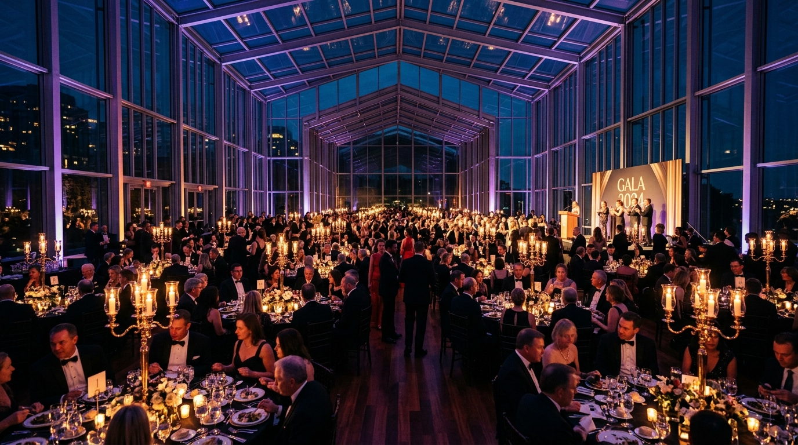

# EVENTLY — The Premier Event Operations Platform & OS

[](landing.html)

**EVENTLY** es un sistema operativo integral de operaciones y producción de eventos de alta gama, diseñado para directores de producción, organizadores de festivales, cumbres corporativas y galas protocolares.

---

## 🚀 Módulos & Arquitectura

### 1. 🌐 Landing Page Oficial de Servicios (`landing.html`)
- **Identidad de Marca**: Diseño moderno con gradientes HSL y tipografía vectorial.
- **Showcase Multimedia**: Reproductor de video promocional (`assets/video/evently_intro.mp4`) y soundtrack estéreo lounge (`assets/music/event_lounge_ambient.wav`).
- **Bento Grid de Servicios**: 
  - *Smart Seating IA*: Optimización algorítmica de mesas por afinidad y jerarquía.
  - *Event-Day Commander*: Consola táctica de alta velocidad para personal en campo.
  - *VIP Concierge & Fast Pass*: Acreditación en < 0.4s con confirmación y fanfarria sonora.
  - *Vendor & Budget War Room*: Trazabilidad financiera y auditoría de proveedores.
  - *Run of Show*: Minuta técnica segundo a segundo.
- **Estimador Interactivo**: Calculadora de aforo, mesas y puntos de acceso QR en tiempo real.

### 2. 🎛️ Consola Operativa Principal (`index.html`)
- **Event-Day Mode**: Modo de pantalla completa de alto contraste para coordinadores en sitio.
- **Control de Accesos & Acreditación QR**: Con feedback auditivo (`assets/music/checkin_beep_success.wav` y `assets/music/vip_arrival_fanfare.wav`).
- **Media & Assets Vault**: Hub interactivo para reproducir y descargar los recursos del proyecto.
- **Gestión de Invitados, Mesas, Presupuestos y Tareas**.

### 3. 🧠 Smart Guest Control (`smart-guest-control/`)
- Desarrollado con **React 18**, **TypeScript**, **Vite** y **Tailwind CSS**.
- Totalmente integrado en `index.html` mediante un iframe responsive con deep-linking vía hash routing (`#/admin/dashboard`, `#/reception`, etc.).
- Compilación de producción incluida en `smart-guest-control/dist/`.

---

## 📁 Estructura de Assets Oficiales (`assets/`)

```bash
assets/
├── logo/
│   ├── logo-full.svg             # Logo horizontal oficial corporativo (Vectorial)
│   └── logo-icon.svg             # Isotipo y favicon (Prisma geométrico)
├── images/
│   ├── hero_gala_event.jpg       # Fotografía 16:9 de Gala & Pabellón de Cristal
│   ├── concert_arena_stage.jpg   # Fotografía 16:9 de Festival & Arena en Vivo
│   └── corporate_tech_summit.jpg # Fotografía 16:9 de Cumbre Corporativa Global
├── music/
│   ├── event_lounge_ambient.wav  # Pista musical ambiental lounge estéreo (Cmaj7/Am7)
│   ├── checkin_beep_success.wav  # Tono futurista de confirmación de QR escaneado
│   ├── vip_arrival_fanfare.wav   # Fanfarria armónica para llegadas VIP
│   └── TODO PASA AQUÍ.wav        # Master track de audio original del proyecto
└── video/
    ├── evently_intro.mp4         # Video reel institucional HD 720p con audio sincronizado
    └── video.mp4                 # Video teaser original del proyecto
```

---

## 💻 Ejecución Local

### Opción 1: Servidor Estático Rápido (Python)
Desde la raíz del proyecto:
```bash
python -m http.server 8080
```
- **Consola Operativa**: [http://localhost:8080/](http://localhost:8080/)
- **Landing de Servicios**: [http://localhost:8080/landing.html](http://localhost:8080/landing.html)

### Opción 2: Entorno de Desarrollo React (Smart Guest Control)
```bash
cd smart-guest-control
npm install
npm run dev
```

---

## 🛠️ Estándar de Ingeniería
- Desarrollado bajo arquitectura limpia y principios **Senior Principal**.
- Código modular, sin librerías pesadas innecesarias en la base estática.
- Audio interactivo con manejo seguro de autoplay policies de los navegadores.

© 2026 EVENTLY by Arcano Solutions. Todos los derechos reservados.
